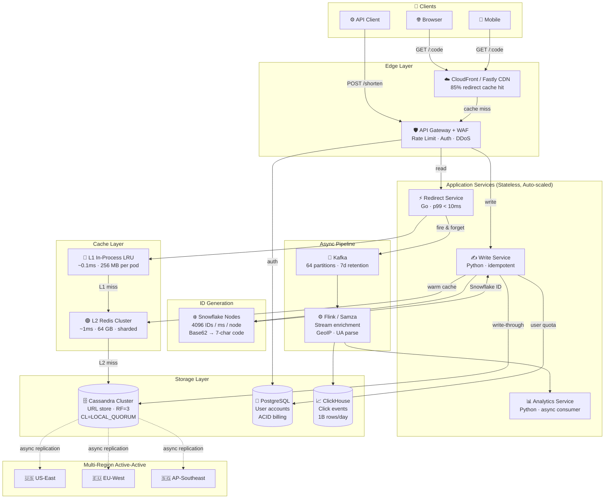

# URL Shortener System Design

> Senior-level distributed system design: 100M writes/day · 10B redirects/day · 99.99% availability

**Scope:** Public URL shortening service (think bit.ly / TinyURL) with analytics, custom aliases, and global low-latency redirect.

---

## System Architecture Diagram



| Metric | Value |
|--------|-------|
| Cache Layers | 3-Tier |
| CDN Hit Rate | 85% |
| Regions | 3 Active |
| P99 Redirect | < 10ms |

---

## Requirements & Scale

### Functional Requirements

**Core Features**
- Shorten long URL → 7-char short code
- Redirect short URL to original (< 10ms p99)
- Custom aliases (e.g. short.ly/launch2026)
- Link expiration (TTL configurable)
- User accounts & link management dashboard
- Real-time click analytics (geo, device, referrer)

**Non-Functional Requirements**
- Availability: 99.99% (< 52 min downtime/year)
- Redirect latency: p50 < 5ms, p99 < 10ms
- Consistency: eventual OK for analytics, strong for redirects
- Idempotency: same long URL → same short code per user
- Security: rate limiting, phishing detection, link preview

### Capacity Estimation

| Metric | Value |
|--------|-------|
| URL Writes/day | 100M |
| Redirects/day | 10B |
| Read:Write Ratio | 100:1 |
| 5-Year Storage | ~90 TB |

**Write Path QPS**
- Peak Writes: 1,160/s
- Burst (3x): 3,500/s

**Read Path QPS**
- Avg Redirects: 115K/s
- Peak (5x): 575K/s

**Storage Math**
> 100M × 365 × 5 = 182.5B rows
> ~500 bytes/row → **91 TB**
> Analytics events: +2× → ~180 TB total

**QPS by Service (steady state)**

| Service | QPS |
|---------|-----|
| URL Write | 1,160 |
| Redirect | 115,000 |
| Analytics | 115,000 |
| Dashboard | 5,000 |

---

## Read & Write Paths

### Write Path — Create Short URL

1. **Step 1:** Client → POST /shorten — API Gateway validates JWT + rate limit
2. **Step 2:** URL Service — normalise URL, strip tracking params
3. **Step 3:** Dedup check — query Redis/DB: same user + long_url exists?
4. **Step 4:** ID Generation — Snowflake node generates 64-bit ID → Base62 encode → 7-char code
5. **Step 5:** Collision check — GET Cassandra by short_code; retry with +1 sequence if collision
6. **Step 6:** Dual write — write to Cassandra (CL=QUORUM), write-through to Redis
7. **Step 7:** Event publish — Kafka topic url-created (async, non-blocking)
8. **Step 8:** Response — return {short_url, expires_at, analytics_url} in < 50ms

### Read Path — Redirect

1. **Step 1:** Client → GET /abc1234 — CDN checks edge cache (85% hit rate)
2. **Step 2:** CDN miss → API Gateway → Redirect Service pod
3. **Step 3:** L1 cache — in-process LRU lookup (< 0.1ms, ~60% hit)
4. **Step 4:** L2 cache — Redis Cluster lookup (< 1ms, ~35% hit of remainder)
5. **Step 5:** DB read — Cassandra LOCAL_QUORUM, nearest replica (< 5ms)
6. **Step 6:** Cache warm — async write-back to Redis + CDN surrogate-key tag
7. **Step 7:** Expiry check — is expires_at in past? → 410 Gone
8. **Step 8:** Click event — fire-and-forget publish to Kafka (async goroutine)
9. **Step 9:** 302 redirect — Location: {long_url}, total p99 < 10ms

```go
// redirect_handler.go
func (h *Handler) Redirect(w http.ResponseWriter, r *http.Request) {
    code := chi.URLParam(r, "code")

    // L1: in-process LRU (~0.1ms)
    if url, ok := h.l1.Get(code); ok {
        h.publishClick(code, r) // fire-and-forget
        http.Redirect(w, r, url, http.StatusFound)
        return
    }

    // L2: Redis cluster (~1ms)
    url, err := h.redis.Get(r.Context(), "url:"+code).Result()
    if err == nil {
        h.l1.Set(code, url)
        h.publishClick(code, r)
        http.Redirect(w, r, url, http.StatusFound)
        return
    }

    // L3: Cassandra (LOCAL_QUORUM)
    row, err := h.db.GetURL(r.Context(), code)
    if err != nil || !row.IsActive {
        http.NotFound(w, r)
        return
    }
    if row.ExpiresAt != nil && row.ExpiresAt.Before(time.Now()) {
        http.Error(w, "Gone", http.StatusGone)
        return
    }

    // warm both caches async
    go h.redis.Set(context.Background(), "url:"+code, row.LongURL, 24*time.Hour)
    h.l1.Set(code, row.LongURL)

    h.publishClick(code, r)
    http.Redirect(w, r, row.LongURL, http.StatusFound)
}
```

**Redirect Request Served By**

| Source | Share |
|--------|-------|
| CDN Edge | 85% |
| Redis L1 | 9% |
| Redis L2 | 5% |
| Cassandra | 1% |

> **💡 302 vs 301 Trade-off:** Use 302 (Found) instead of 301 (Moved Permanently). 301 is cached by browsers indefinitely — you lose analytics and can't update the target. 302 always hits your servers, enabling click tracking and link editing. CDN handles caching at scale.

---

## Data Model

### URLs Table (Cassandra)

| Column | Type | Notes |
|--------|------|-------|
| short_code | text (PK) | Base62, 7 chars, partition key |
| long_url | text | Original URL, max 2048 chars |
| user_id | uuid | Owner; null for anonymous |
| created_at | timestamp | Snowflake-derived |
| expires_at | timestamp | Null = never |
| is_custom | boolean | Custom alias flag |
| click_count | counter | Approximate; Cassandra counter column |
| is_active | boolean | Soft delete / deactivate |

```sql
-- urls.cql
CREATE TABLE urls (
    short_code  text        PRIMARY KEY,
    long_url    text        NOT NULL,
    user_id     uuid,
    created_at  timestamp   NOT NULL,
    expires_at  timestamp,
    is_custom   boolean     DEFAULT false,
    is_active   boolean     DEFAULT true
) WITH default_time_to_live = 0
  AND compaction = {'class': 'LeveledCompactionStrategy'}
  AND gc_grace_seconds = 86400;

-- counter table (separate in Cassandra)
CREATE TABLE url_clicks (
    short_code  text    PRIMARY KEY,
    click_count counter
);
```

### Users Table (PostgreSQL)

| Column | Type | Notes |
|--------|------|-------|
| user_id | uuid (PK) | — |
| email | text UNIQUE | — |
| plan_tier | enum | free / pro / enterprise |
| rate_limit | int | Max creates/day |
| created_at | timestamp | — |

```sql
-- users.sql
CREATE TYPE plan_tier AS ENUM ('free', 'pro', 'enterprise');

CREATE TABLE users (
    user_id    uuid        PRIMARY KEY DEFAULT gen_random_uuid(),
    email      text        UNIQUE NOT NULL,
    plan_tier  plan_tier   NOT NULL DEFAULT 'free',
    rate_limit int         NOT NULL DEFAULT 50,
    created_at timestamptz NOT NULL DEFAULT now()
);

CREATE INDEX idx_users_email ON users(email);
```

> **💡 Why two databases?** URLs table is read-heavy, append-only, and benefits from Cassandra's partition-key lookup. Users table is relational with joins and ACID needs — PostgreSQL is the right tool.

### Click Events (ClickHouse)

| Column | Type | Notes |
|--------|------|-------|
| short_code | LowCardinality(String) | Join key |
| clicked_at | DateTime64 | Millisecond precision |
| country | LowCardinality(String) | MaxMind GeoIP |
| city | String | — |
| device_type | LowCardinality(String) | mobile / desktop / bot |
| referrer_domain | String | Stripped to domain only |
| ip_hash | UInt64 | SHA-256 truncated, no PII |

```sql
-- click_events.sql (ClickHouse)
CREATE TABLE click_events (
    short_code      LowCardinality(String),
    clicked_at      DateTime64(3),
    country         LowCardinality(String),
    city            String,
    device_type     LowCardinality(String),
    referrer_domain String,
    ip_hash         UInt64
) ENGINE = MergeTree()
PARTITION BY toYYYYMM(clicked_at)
ORDER BY (short_code, clicked_at)
TTL clicked_at + INTERVAL 2 YEAR;
```

> **⚠️ Privacy:** Raw IP is never stored. ip_hash uses a rotating daily salt — re-identification across days is impossible. GDPR-compliant by design.

### Cache Key Design

| Key Pattern | Value | TTL |
|-------------|-------|-----|
| url:{short_code} | long_url string | 24h (sliding) |
| user:{user_id}:links | paginated link list JSON | 5 min |
| analytics:{short_code}:24h | aggregated click stats | 1h |
| ratelimit:{ip}:{minute} | request count | 60s |

---

## Scalability & Reliability

### Horizontal Scaling

- Redirect Service: stateless, auto-scale 50→500 pods on CPU/QPS
- URL Write Service: stateless, scale independently
- Cassandra: add nodes, rebalances automatically (virtual nodes)
- Redis: cluster sharding by short_code hash slot
- Kafka: add partitions + consumer group members

### Multi-Region Active-Active

- 3 regions: US-East, EU-West, AP-Southeast
- Cassandra cross-region replication (async, RF=3 per region)
- Redirect service reads LOCAL_QUORUM — no cross-region latency
- Writes: route to nearest region, async replicate
- Global Load Balancer (Anycast) routes by latency

### Failure Modes & Mitigations

| Failure | Detection | Mitigation |
|---------|-----------|------------|
| Redis down | Health check | Fallback to Cassandra; degrade gracefully |
| Cassandra node down | Gossip protocol | RF=3; reads still succeed with 2 nodes |
| Kafka lag spike | Consumer lag metric | Scale consumers; shed non-critical events |
| ID generator down | Heartbeat | Multiple Snowflake nodes; no SPOF |
| CDN outage | Synthetic monitor | Origin handles full load; auto-scaled |

### SLO Targets

| Metric | Value | Target |
|--------|-------|--------|
| Redirect Availability | 99.99% | 99.99% |
| P99 Redirect Latency | 8ms | 10ms |
| Write Availability | 99.95% | 99.9% |
| Analytics Freshness | 30s | 60s |

**Cache Hit Rate vs Latency (p99 ms)**

| Layer | P99 Latency |
|-------|-------------|
| CDN | 2ms |
| Redis L1 | 3ms |
| Redis L2 | 5ms |
| Cassandra | 9ms |

---

## Design Decisions

### Decision 1: Short Code Generation — Snowflake + Base62

**✅ Chosen: Snowflake + Base62**
> 64-bit Snowflake ID → Base62 encode → 7-char code. Monotonically increasing = cache-friendly. No central coordination. 4096 unique codes/ms/node.

**❌ Rejected: Random + Collision Check**
> Hash(long_url) → truncate → check DB. Collision probability grows with scale. Requires read-before-write on every creation. DB hot-spot under high write load.

```go
// base62.go
const alphabet = "0123456789ABCDEFGHIJKLMNOPQRSTUVWXYZabcdefghijklmnopqrstuvwxyz"

// Encode converts a Snowflake uint64 to a 7-char Base62 string.
// 62^7 = 3.5 trillion — enough for decades of 100M writes/day.
func Encode(n uint64) string {
    buf := make([]byte, 7)
    for i := 6; i >= 0; i-- {
        buf[i] = alphabet[n%62]
        n /= 62
    }
    return string(buf)
}
```

### Decision 2: Storage — Cassandra for URLs, PostgreSQL for Users

**✅ Chosen: Cassandra**
> Partition key = short_code → single-row lookup. Linear write scale. Multi-DC replication native. Handles 100K+ reads/sec without sharding logic in app layer.

**❌ Rejected: PostgreSQL as primary**
> Single master write bottleneck. Requires manual sharding at 10B+ rows. Read replicas add lag. Fine for user metadata (low volume), wrong for URL lookups (high volume).

### Decision 3: 302 over 301 Redirect

> **💡 302 over 301:** 301 (Permanent Redirect) is cached by browsers indefinitely — once a browser caches it, you can never change the destination or track clicks from that browser. 302 (Found / Temporary) always re-queries your server, enabling analytics, link editing, and abuse deactivation. CDN absorbs the load.

### Decision 4: Async Analytics via Kafka

> **💡 Async via Kafka:** Click analytics must never block the redirect. A synchronous write to ClickHouse on the hot path adds 10-50ms and creates a cascade failure point. Kafka decouples the click event: redirect returns in < 5ms, analytics processes asynchronously. Acceptable to lose < 0.1% of events if Kafka is unavailable.

### Tech Stack Summary

| Layer | Technology | Why |
|-------|------------|-----|
| Edge Cache | CloudFront/Fastly | Global PoPs reduce origin load 85% |
| API Gateway | Kong / AWS API GW | Rate limiting + auth + routing |
| App Services | Go (Redirect) + Python (Write) | Go for latency-critical; Python for ML/analytics |
| Primary DB | Cassandra 4.x | Partition-key O(1) lookup at scale |
| Cache | Redis 7 Cluster | Sub-ms latency; LRU eviction |
| Analytics DB | ClickHouse | Columnar; 1B+ rows/day ingest |
| Message Bus | Kafka (MSK) | Decouples hot redirect path |
| ID Gen | Snowflake (in-house) | No SPOF; 4096 IDs/ms/node |
| Monitoring | Prometheus + Grafana | RED metrics per service |
